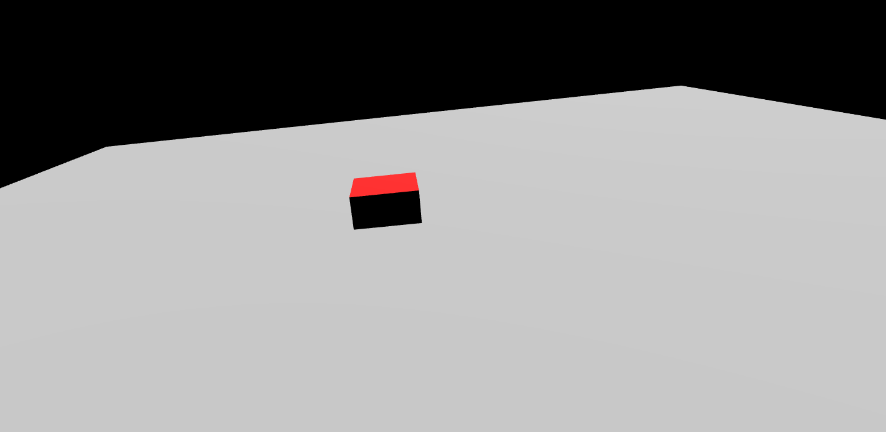
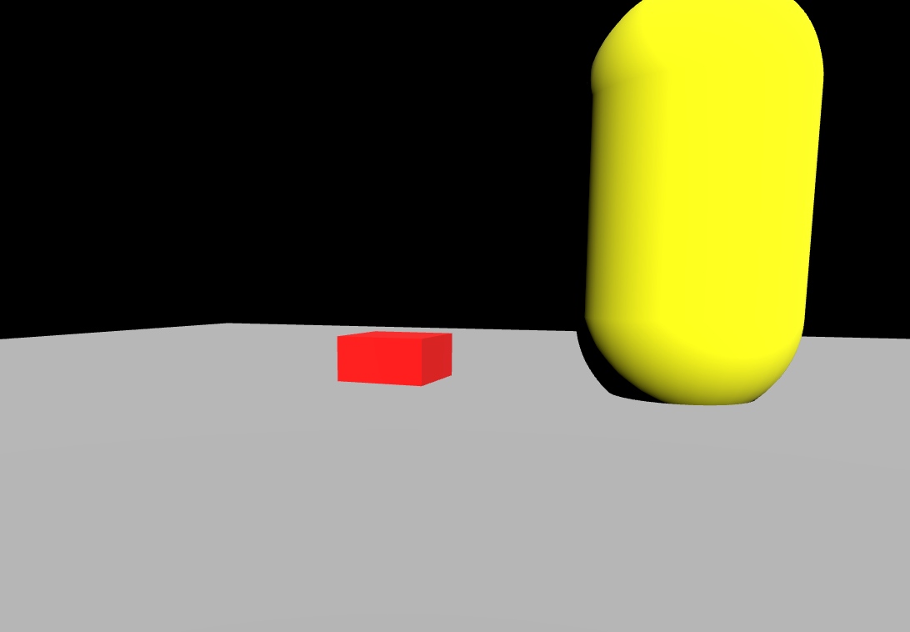
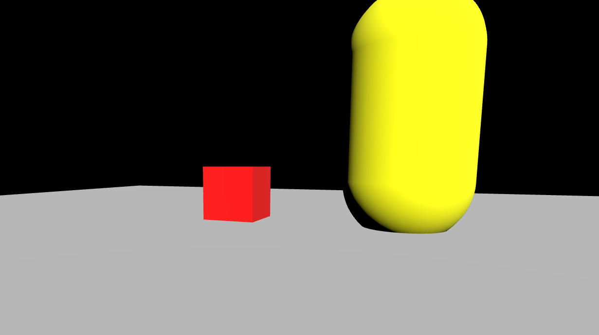

# Three JS 공부
## ThreeJS란?
WebGL을 쉽게 사용할 수 있도록 해주는 JS기반 라이브러리입니다.

WebGL: Web Graphics Library

<a href="https://threejs.org/">Three JS를 활용한 웹 사이트</a>

<a href="https://threejs.org/docs/index.html#manual/en/introduction/Installation">공식문서</a>

<a href="https://threejs.org/manual/#ko/fundamentals">참고사이트</a>
## 프로젝트 생성
폴더생성 후 해당 폴더 vscode로 열고 아래 명령 실행
```
npm create vite@latest ./ -- --template vinilla
```

이후 불필요한 파일들 삭제해주고 아래 명령 실행
```
npm install three
```

### Camera
PerspectiveCamera(원근 카메라)
- 일반적인 카메라
- 멀리 있는 물체를 가까이 있는 것보다 상대적으로 작게 보이도록 함

OrthographicCamera(정사영 카메라)

## 프로젝트
### main.js
```js
import './style.css'
import * as THREE from 'three'

const scene = new THREE.Scene() // 촬영장소 만들기
const camera = new THREE.PerspectiveCamera(
    60, // fov: 시야각
    window.innerWidth/window.innerHeight, // aspect: 촬영하는 장면에 가로와 세로의 비율
    0.1, // near
    100 // far
)
camera.position.y = 1
camera.position.x = 3
camera.position.z = 7


const geometry = new THREE.BoxGeometry(1,1,1) // Mesh 넓이, 높이, 깊이
const material = new THREE.MeshBasicMaterial({color: 0xff0000})
const mesh = new THREE.Mesh(geometry, material) // mesh 생성 geometry와 material 필요

scene.add(mesh)

const renderer = new THREE.WebGLRenderer()
renderer.setSize(window.innerWidth, window.innerHeight)
document.body.appendChild(renderer.domElement)

window.addEventListener('resize', () => {
    renderer.setSize(window.innerWidth, window.innerHeight)
    camera.aspect = window.innerWidth/window.innerHeight
    camera.updateProjectionMatrix()
    renderer.render(scene, camera)
})

renderer.render(scene, camera)
```

### antialias
**적용전**


```js
const renderer = new THREE.WebGLRenderer()
```

**적용후**


```js
const renderer = new THREE.WebGLRenderer({antialias: true})
```

### MeshBasicMaterial MeshStandardMaterial
**MeshBasicMaterial**
```js
const material = new THREE.MeshBasicMaterial({color: 0xff0000})
```

**MeshStandardMaterial**
```js
const directionalLight = new THREE.DirectionalLight(0xffffff, 5) // 색, 색의 세기
directionalLight.castShadow = true
directionalLight.position.set(3,4,5)
directionalLight.lookAt(0, 0, 0)
scene.add(directionalLight)

const material = new THREE.MeshStandardMaterial({color: 0xff0000})
// MeshBasicMaterial이 아닌 Material은 빛의 영향을 받는다
```

### OrbitControls
```js
const orbitControls = new OrbitControls(camera, renderer.domElement)
orbitControls.update()
// orbitControls가 정상적으로 동작하기 위해 requestAnimation 프레임사용

// render 함수 수정
const render = () => {
    renderer.render(scene, camera)
    requestAnimationFrame(render)
}

render()
```

## floor 추가
```js
const floorGeometry = new THREE.PlaneGeometry(20, 20)
const floorMaterial = new THREE.MeshStandardMaterial({color: 0xbbbbbb})
const floor = new THREE.Mesh(floorGeometry, floorMaterial)
scene.add(floor)
```




## PlaneGeometry CapsuleGeometry 추가
```js
// PlaneGeometry 생성
const floorGeometry = new THREE.PlaneGeometry(20, 20)
const floorMaterial = new THREE.MeshStandardMaterial({color: 0xbbbbbb})
const floor = new THREE.Mesh(floorGeometry, floorMaterial)
floor.rotation.x = -Math.PI / 2 //  PI는 180°. 즉, 총 -90°만큼 회전
floor.receiveShadow = true // 그림자를 받을 수 있게 해줌
floor.castShadow = true
scene.add(floor)

// CapsuleGeometry 생성
const capsuleGeometry = new THREE.CapsuleGeometry(1, 2, 20, 30)
const capsuleMaterial = new THREE.MeshStandardMaterial({color: 0xffff00})
const capsuleMesh = new THREE.Mesh(capsuleGeometry, capsuleMaterial)
capsuleMesh.position.set(3, 1.75, 0)
capsuleMesh.receiveShadow = true
capsuleMesh.castShadow = true
scene.add(capsuleMesh)
```



### 박혀있는 거 같은 mesh 수정
```js
mesh.castShadow = true
mesh.position.y = 0.5
scene.add(mesh)
```



### 그림자가 나오지 않는 부분 수정
```js
const renderer = new THREE.WebGLRenderer({antialias: true})
renderer.shadowMap.enabled = true // 추가
renderer.setSize(window.innerWidth, window.innerHeight)
document.body.appendChild(renderer.domElement)
```

